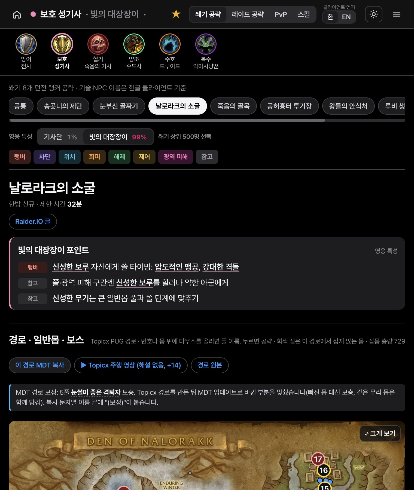
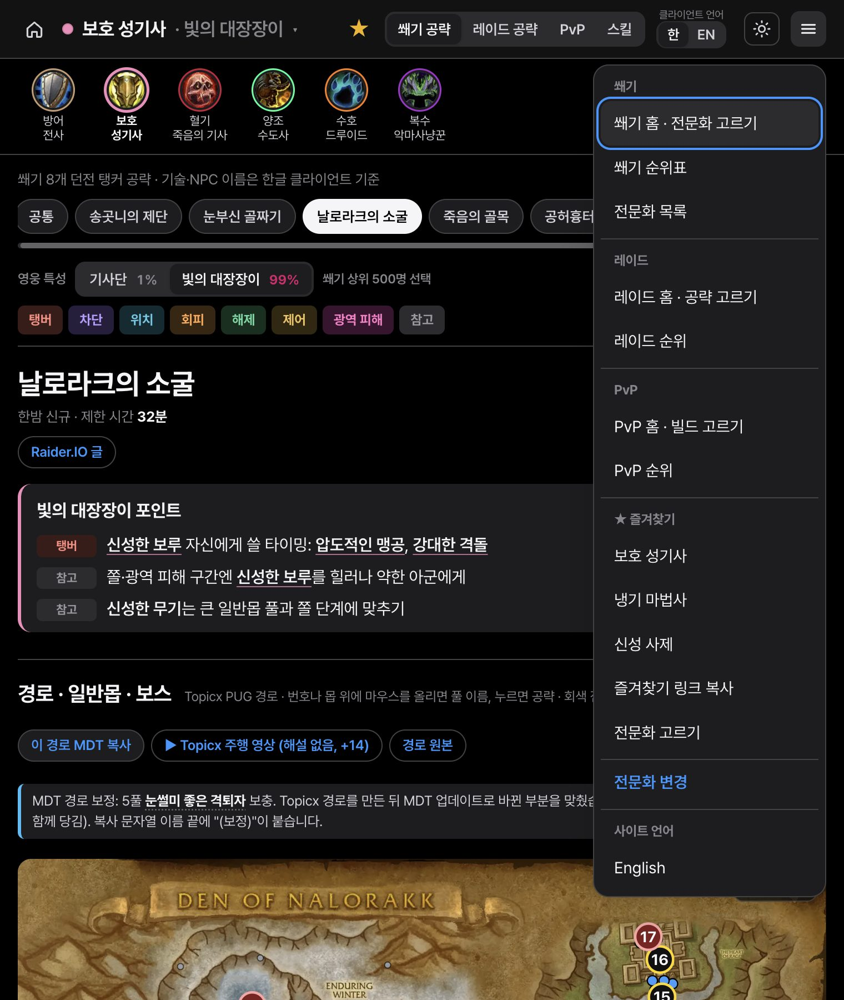
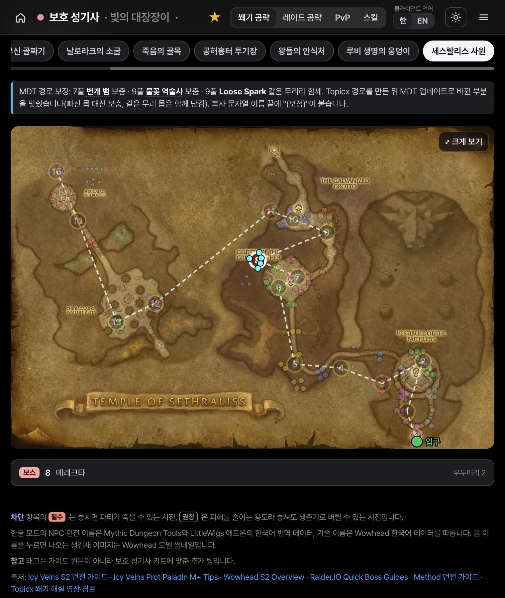
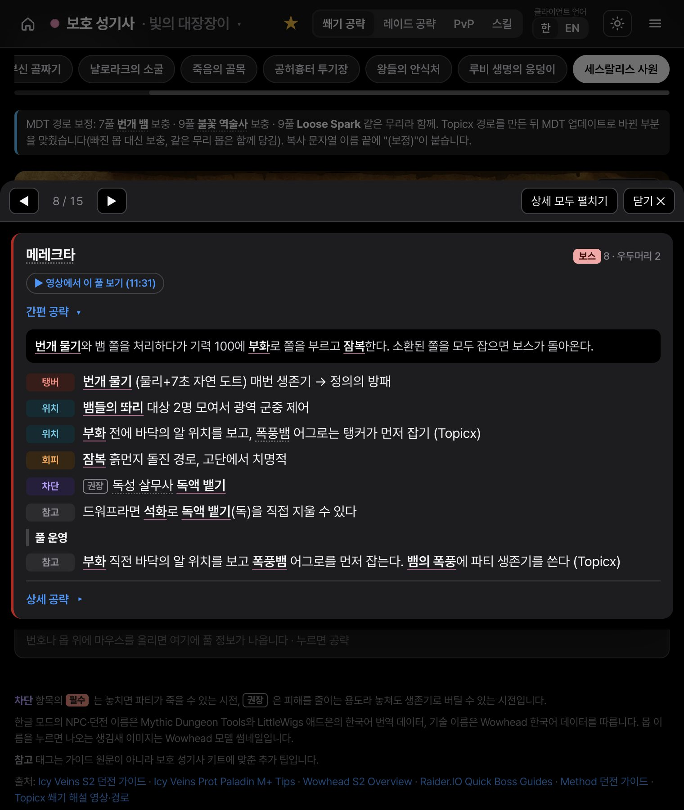
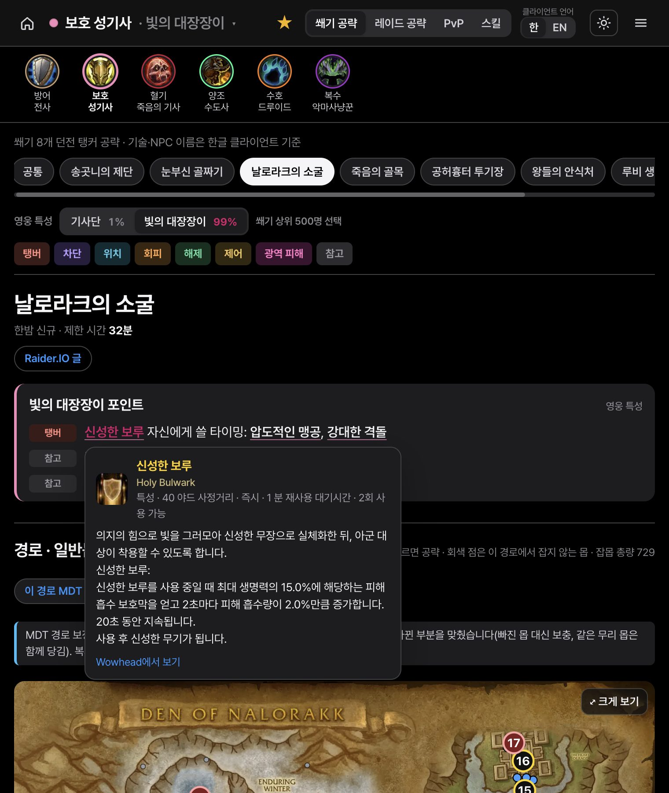
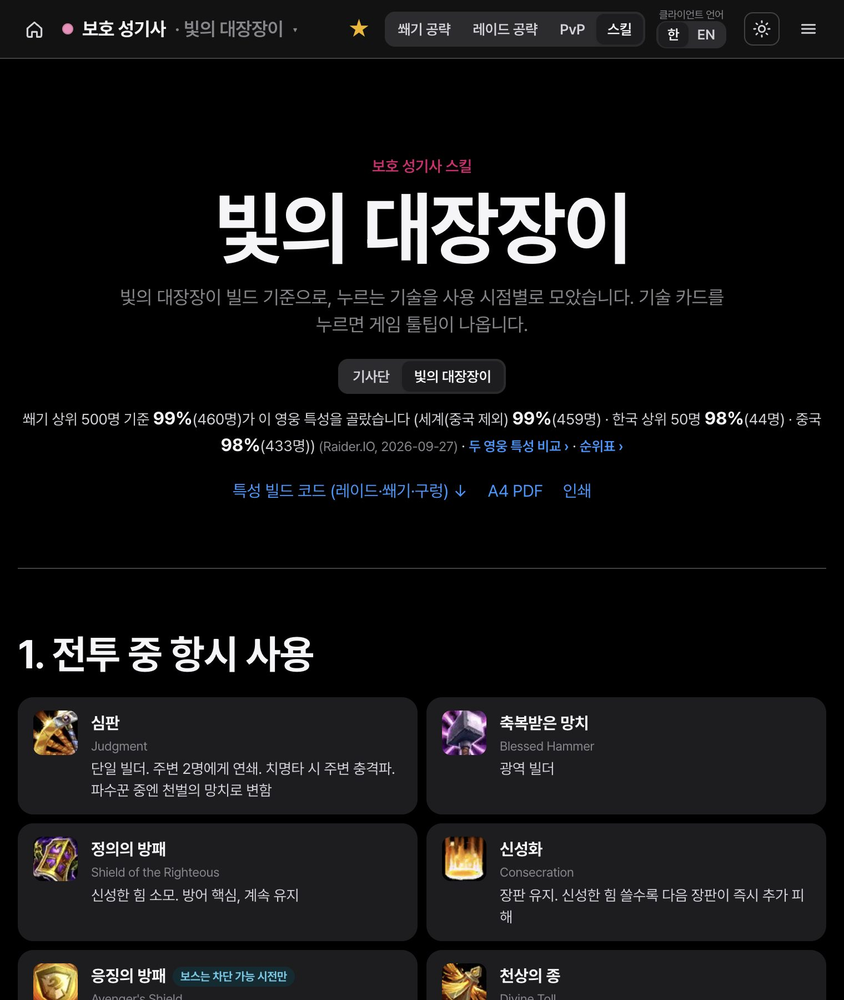
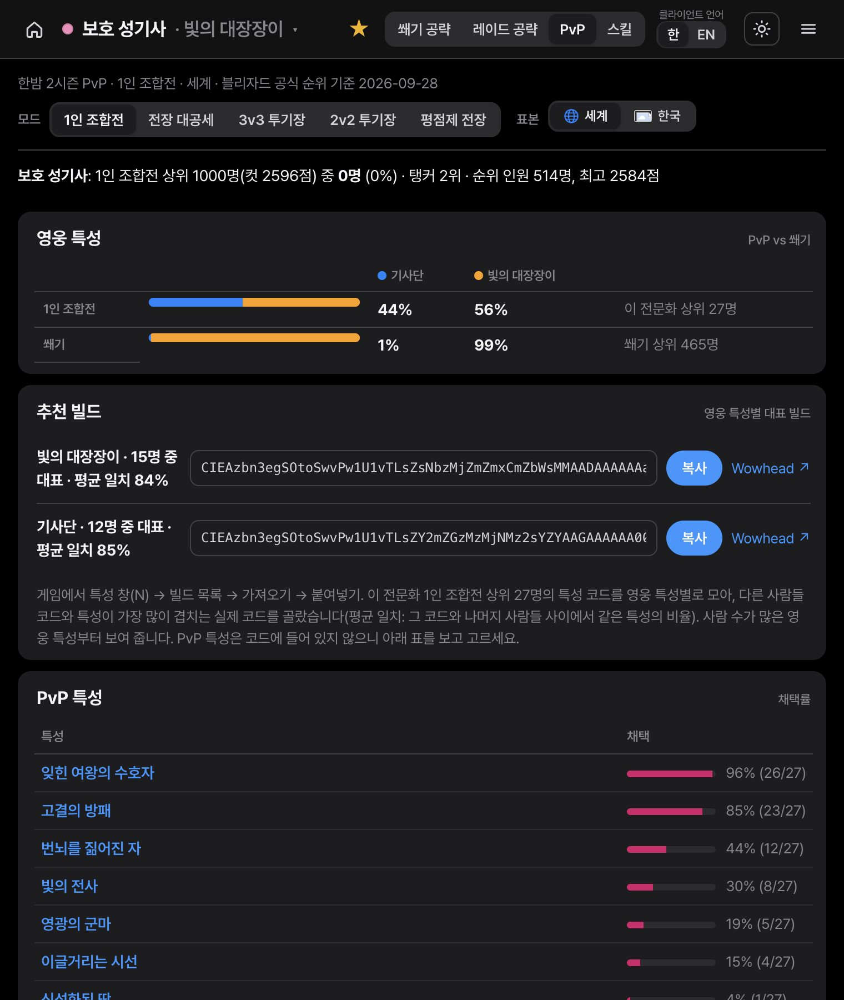
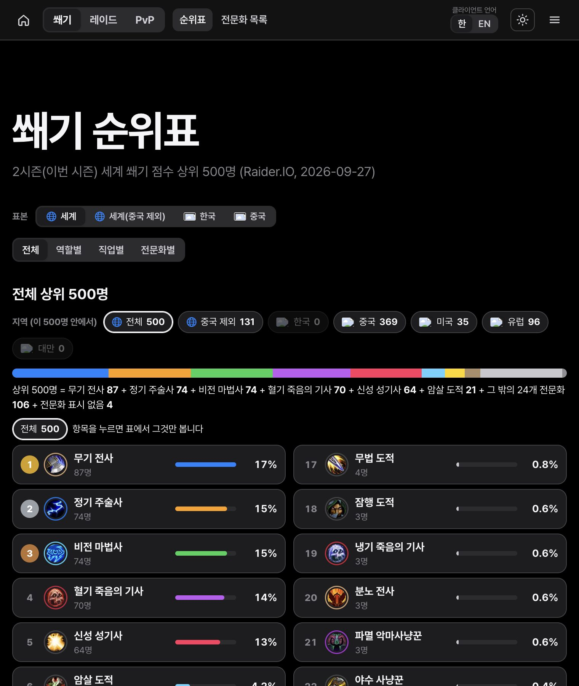

# 와우 공략 (한국어)

**https://ggah1911.github.io/wow-guide-kr/** · English: https://ggah1911.github.io/wow-guide-kr/?ui=en

월드 오브 워크래프트 한밤(Midnight) 2시즌의 쐐기, 레이드, PvP 공략을 내 전문화 기준으로 보여 주는 한국어 사이트입니다. 13개 직업 40개 전문화를 모두 다루고, 기술과 NPC 이름은 기본이 한글 표기이고, 헤더의 한/EN 버튼으로 영문 클라이언트 표기로 바꿀 수 있습니다. 서버 없이 정적 파일만으로 돌아가며, 순위와 빌드 통계는 매일 자동으로 갱신됩니다.


## 무엇을 볼 수 있나

| | 내용 |
|---|---|
| **쐐기** | 던전 8개의 경로 지도와 풀 116개 공략, 풀마다 40개 전문화가 할 일, 풀 시작 장면으로 바로 가는 주행 영상 링크, 게임에 붙여 넣는 MDT 경로 문자열, 영웅 특성 비교, 특성 빌드 코드 |
| **레이드** | 2시즌 맹독 심연 8보스와 소굴 1보스, 1시즌 레이드 4개 10보스, 일반·영웅·신화 난이도 전환, 신화 상위 공격대의 전문화 조합 |
| **PvP** | 1인 조합전, 전장 대공세, 3v3·2v2 투기장, 평점제 전장의 상위권 전문화 비율과 대표 빌드, 전장 9개와 투기장 16개 공략, 전문화별 PvP 전략 |
| **순위** | Raider.IO 쐐기 점수 상위 500명을 세계, 세계(중국 제외), 한국, 중국으로 나눠 역할, 직업, 전문화별 비율로 정리 |

## 처음 쓸 때

첫 화면에서 **직업, 전문화, 영웅 특성**을 차례로 고르면 그 전문화의 공략이 열립니다. 역할(탱커, 힐러, 딜러)부터 고를 수도 있습니다. 고른 전문화는 이 기기에 저장되므로 다음부터는 위쪽 헤더의 전문화 이름으로 바로 들어갑니다.

전문화 페이지에는 **쐐기 공략, 레이드 공략, PvP, 스킬** 네 탭이 있습니다. 영웅 특성 버튼 옆에는 쐐기 상위 500명이 그 영웅 특성을 고른 비율이 붙어 있고, 버튼을 바꾸면 아래 공략도 그 영웅 특성 기준으로 바뀝니다. 몹과 보스 줄마다 붙은 태그(탱버, 위치, 회피, 차단, 해제, 생존기 등)를 눌러 필요한 줄만 모아 볼 수 있습니다.



헤더의 단추는 다음 일을 합니다.

- **★ 즐겨찾기**: 전문화를 별로 저장합니다(여러 개 가능). 첫 화면과 전문화 변경 창에 칩으로 뜨고, 메뉴의 "즐겨찾기 링크 복사"로 다른 기기에 같은 목록을 옮길 수 있습니다.
- **한 / EN**: 기술, NPC, 전문화 이름과 툴팁을 한글 클라이언트 표기와 영문 클라이언트 표기 사이에서 바꿉니다. 처음에는 한글이고, 고른 쪽은 이 기기에 저장됩니다.
- **해 아이콘**: 어두운 화면과 밝은 화면을 바꿉니다. 처음에는 어두운 화면이고 기기 설정은 따르지 않습니다.
- **메뉴**: 쐐기, 레이드, PvP의 모든 페이지, 즐겨찾기, 전문화 변경, 사이트 언어(한국어, English) 전환이 있습니다.



## 쐐기: 경로 지도에서 풀 단위로 보기

던전 탭을 고르면 그 던전의 **경로 지도**가 나옵니다. 지도에는 Topicx PUG 경로가 풀 번호 1, 2, 3 순서로 그려져 있고, 이 경로대로 당기면 잡몹 100%를 채웁니다. 번호나 몹에 마우스를 올리면 풀 이름과 누적 %가 지도 아래에 뜨고, 누르면 그 풀의 공략 팝업이 열립니다. 회색 점은 이 경로에서 잡지 않는 몹입니다. 지도 오른쪽 위의 "크게 보기"는 전체 화면으로 열어 두 손가락(PC는 휠)으로 확대하고 한 손가락으로 움직일 수 있게 합니다.



**풀 팝업**에는 그 풀의 몹 구성, 몹마다 내 전문화가 할 일, 보스 풀이면 간편 공략과 상세 공략이 들어 있습니다. ◀ ▶ 로 앞뒤 풀로 넘어가고, Esc나 바깥을 누르거나 모바일의 뒤로 가기 버튼으로 닫습니다.



- **MDT 경로 문자열**: "이 경로 MDT 복사"를 누르고 게임의 `/mdt` 에서 Import에 붙여 넣으면 같은 경로를 쓸 수 있습니다. Topicx가 경로를 올린 뒤 MDT 업데이트로 바뀐 몹은 보충하거나 같은 무리로 묶어서, 8개 던전 모두 잡몹 100% 이상이 되게 맞췄습니다. 고친 풀은 지도 위에 적어 두고, 복사 문자열의 이름 끝에 "(보정)"이 붙습니다.
- **내 경로**: 경로 머리의 "기본 경로 · 내 경로" 전환에서 "내 경로"를 고르고, 게임의 `/mdt` 에서 내보내기로 복사한 문자열을 붙여 넣으면 그 경로를 같은 지도와 풀 팝업으로 그립니다. 다른 던전 경로를 넣으면 그 던전 탭으로 넘어갑니다. 문자열은 브라우저 안에서만 풀고 그 브라우저에만 저장하며, 어디로도 보내지 않습니다. 내 경로의 일반 풀에는 몹 구성과 몹 기술만 나오고, 풀 운영 메모와 전문화 풀 공략은 기본 경로에서 볼 수 있습니다.
- **선 꺾기**: 지도의 경로 선이 벽을 지나가면 "⤢ 크게 보기" 화면 오른쪽 위의 "✎ 선 꺾기"를 눌러 고칠 수 있습니다. 선을 누르면 꺾임점이 생기고, 점을 끌어 옮기고, 두 번 누르면 지웁니다(되돌리기, 모두 지우기 있음). "완료"를 누르면 편집만 끝나고 크게 보기 화면은 그대로입니다. 기본 경로와 내 경로에 따로, 이 브라우저에만 저장되고, 내 경로 문자열을 바꾸면 그 경로의 꺾임은 지워집니다.
- **공유 링크와 MDT 내보내기**: "🔗 공유 링크"는 지금 보는 경로(내 경로면 그 문자열)와 꺾은 선을 담은 주소를 복사합니다. 받은 사람에게는 저장하지 않은 "공유받은 경로"로 먼저 보이고, "저장"을 눌러야 그 브라우저에 남습니다. "선 포함 MDT 복사"는 경로 선(꺾은 곳 포함)을 MDT 그림 선으로 넣은 문자열을 복사합니다. 게임의 `/mdt` 가져오기로 넣으면 이름 끝에 "(경로 선)"이 붙은 새 경로로 들어옵니다. 이 경로를 MDT에서 다시 내보내 "내 경로"에 붙이면 꺾은 선이 되살아나고, 다시 복사해도 선이 겹치지 않고 바뀌며, 같은 경로를 갱신하도록 uid가 그대로 유지됩니다.
- **주행 영상**: 던전마다 Topicx의 **해설 없는** 주행 영상 하나를 연결했습니다. 풀 팝업의 "▶ 영상에서 이 풀 보기 (m:ss)"를 누르면 사이트 안 팝업에서 그 풀이 시작하는 장면부터 재생됩니다.
- **영상 시각의 정확도**: 시각은 영상 화면의 쐐기 목표창 잡몹 %와 몹 이름표를 우리 경로와 대조해서 뽑은 **±10~20초 추정**입니다. 영상이 어떤 풀을 우리 경로와 다른 몹 구성으로 잡으면 링크 옆에 그렇게 적혀 있습니다. 시작 장면을 찾지 못한 풀(Murder Row 14풀, Voidscar Arena 10풀)에는 링크가 없습니다.
- **영어 해설 영상**: Raider.IO 등의 영어 해설 영상은 영문 화면에서만 보입니다. 한국어 화면에는 해설이 없는 주행 영상만 나옵니다.

기술 이름에 마우스를 올리면(모바일은 누르면) 게임과 같은 **툴팁**이 뜹니다.



**스킬** 탭에는 영웅 특성별 기본 딜 순환, 광역, 폭딜 구간, 생존과 차단, 유틸, 유지 버프와 **특성 빌드 코드**(쐐기, 레이드, 구렁용)가 있습니다. 빌드 코드는 복사해서 게임에 붙여 넣습니다.



## 레이드, PvP, 순위

**레이드 공략**은 보스 탭마다 요약, 단계별 상세, 역할별 할 일, 내 전문화 활용 줄로 이루어집니다. 난이도(일반, 영웅, 신화)를 고르면 그 난이도까지의 내용만 보이고, 이번 시즌 보스에는 신화 상위 공격대가 데려간 전문화 조합이 붙습니다. 2시즌과 1시즌 레이드는 위쪽에서 전환합니다.


**PvP** 페이지에는 모드별 대표 빌드(상위권 특성 코드 중 다른 사람들과 가장 많이 겹치는 실제 코드, 복사 가능), 영웅 특성 비율(쐐기와 비교), PvP 특성 채택률, 상위 캐릭터가 있습니다. 그 아래 PvP 전략에는 투기장, 1인 조합전, 전장에서 그 전문화가 할 일이 나옵니다.



**쐐기 순위표**는 상위 500명의 전문화와 영웅 특성 비율을 지역과 역할, 직업, 전문화로 거르며 봅니다. 이름을 누르면 Raider.IO 프로필로 갑니다.



## 데이터 출처와 갱신

| 내용 | 출처 | 갱신 |
|---|---|---|
| 쐐기 순위, 전문화와 영웅 특성 비율 | Raider.IO 쐐기 점수 순위 | 매일 04:00 (한국 시각) |
| 레이드 상위 공격대 조합, 진행 현황 | Raider.IO 레이드 순위와 처치 명단 | 매주 목요일 04:00 |
| PvP 순위, 대표 빌드, PvP 특성 | Blizzard Battle.net 공식 API (미국, 유럽, 한국, 대만) | 매일 04:00 |
| 기술 설명, 툴팁, 한글 기술 이름 | Wowhead 게임 데이터 | 공략을 쓸 때 |
| NPC, 던전 한글 이름 | Mythic Dungeon Tools와 LittleWigs 애드온의 한국어 번역 데이터 | 공략을 쓸 때 |
| 쐐기 경로(풀 구성과 순서) | Topicx PUG 경로의 MDT 문자열 | 시즌이나 MDT 업데이트 때 |
| 내 경로용 몹 위치와 잡몹 점수 | Mythic Dungeon Tools 애드온 던전 데이터 | 시즌이나 MDT 업데이트 때 |
| 던전, 보스, 전장, 투기장 공략 | Wowhead, warcraft.wiki.gg, raidstrats.gg, Icy Veins 등 (페이지마다 출처 표시) | 공략을 쓸 때 |
| 풀별 영상 시점 | Topicx 주행 영상 화면 대조 | 영상을 바꿀 때 |

## 읽을 때 알아 둘 점

- **수치는 툴팁 원문에서만 가져옵니다.** 피해량, 지속시간, 피해 속성 같은 숫자는 Wowhead 툴팁에 있는 것만 씁니다. 출처를 확인하지 못한 내용은 쓰지 않습니다.
- **경로 전략은 Topicx를 따릅니다.** 어떤 몹을 어떤 순서로 당기는지는 Topicx PUG 경로를 그대로 쓰고, Topicx의 개인 메모는 옮기지 않았습니다.
- **일반 원칙으로 쓴 부분이 있습니다.** 전문화별 레이드 활용 줄과 PvP 전략에는 전문화 전용 공략 출처가 없어서, 기술 툴팁, 보스와 지도 기믹, 상위권 실제 채택률을 맞춰 쓴 일반 원칙입니다. 화면에도 그렇게 표시되어 있습니다.
- **공략은 초안입니다.** 게임 패치로 내용이 달라질 수 있습니다.

## 직접 돌려 보기

빌드 도구와 의존성은 없습니다. Node.js(내장 모듈만 사용)만 있으면 됩니다.

```sh
node tools/build.mjs                                # data/ 를 읽어 페이지 HTML 생성(결과물은 커밋해서 Pages가 그대로 서빙)
node tools/dev/pages-sim.mjs . wow-guide-kr 8972    # http://localhost:8972/wow-guide-kr/ 에서 Pages와 같은 경로로 확인
node tools/check/tooltip-parity.mjs                 # 한글 화면과 영문 화면의 툴팁 연결이 같은지 대조(빠진 곳 0건이어야 통과)
```

| 위치 | 내용 |
|---|---|
| `assets/app.js`, `app.css` | 화면을 그리는 엔진. JSON을 불러와 브라우저에서 그립니다 |
| `data/roster.json`, `data/spec/` | 직업과 전문화 목록, 전문화별 공략 데이터(전문화마다 파일 2개, 모두 80개) |
| `data/core/` | 던전, 보스, 몹, 기술 이름과 툴팁, 경로(`routes.json`) |
| `data/role/`, `data/raid/`, `data/pvp/`, `data/rank/` | 역할 공통 층, 레이드, PvP, 순위 |
| `data/**/en/`, `assets/i18n.en.json` | 영문 화면용 데이터와 화면 문구 사전(`?ui=en`) |
| `assets/routes/` | 던전 경로 지도 그림 8장 |
| `<직업>/<전문화>/dungeon/<던전>/` | 던전별 공략 주소 320개. 본문이 HTML에도 들어 있어 검색 엔진이 읽을 수 있고, 스크립트가 켜지면 전체 화면으로 바뀝니다. `sitemap.xml`에 전체 주소가 있습니다 |
| `tools/ci/`, `tools/research/` | 매일 수집과 사이트 조립에 쓰는 스크립트 |
| `.github/workflows/` | `site`(매일 수집, 배포), `check`(PR 검사) |

배포는 GitHub Actions `site` 워크플로가 맡습니다. 매일 04:00(한국 시각)에 Raider.IO와 Battle.net 수치를 받아 `data` 브랜치에 덮어쓰고, `main`의 코드와 합쳐 Pages에 올립니다. 수집 결과에 이상이 있으면 배포하지 않습니다. `main`은 보호되어 있어서 PR로만 바뀌고, `check` 워크플로의 `tooltip-parity`가 통과해야 병합됩니다.

이 저장소는 비공개 작업 사본에서 공개해도 되는 파일만 옮겨 온 것입니다. 그래서 경로 생성기와 번역 스크립트는 들어 있지 않고, `data/core/routes.json`과 영문 데이터는 그 도구가 만든 결과물만 있습니다.

## English

The whole site is also available in English at https://ggah1911.github.io/wow-guide-kr/?ui=en (or menu → English): guides, route maps and pull popups, raid and PvP strategy, rankings and menus. Ability and NPC names follow the English game client. In English, each dungeon also shows the English-commentary route videos; the Korean site links only Topicx's no-commentary runs.

## 라이선스

이 저장소의 **코드**(`assets/`의 엔진, `tools/`의 빌드와 수집 스크립트, HTML 페이지 틀)는 [MIT 라이선스](LICENSE)입니다. 출처 표기만 남기면 복사, 수정, 재배포해도 됩니다.

`data/`(쐐기, 레이드, PvP 데이터), `assets/routes/`(던전 경로 지도 그림), `docs/screenshots/`의 게임 화면은 이 라이선스에 포함되지 않습니다. Wowhead, Raider.IO, Blizzard Battle.net API에서 받았거나 게임 지도 이미지로 만든 것이라 각 서비스와 게임의 이용 조건을 따르며, 이 저장소 밖으로 재배포하지 않습니다.

이 사이트는 비공식 팬 제작 공략 사이트이며 Blizzard Entertainment와 관련이 없거나 후원받지 않았습니다. World of Warcraft, Warcraft, Blizzard Entertainment는 미국 및 다른 국가에서 Blizzard Entertainment, Inc.의 상표 또는 등록상표입니다.
